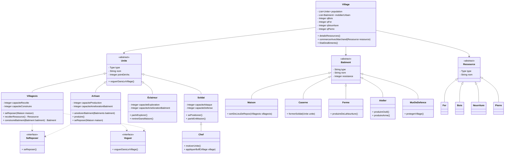

````mermaid
sequenceDiagram
    actor Villageois
    participant Ressources
    participant Village
    participant AncienMur
    participant NouveauMur
    
    participant Maison

    Villageois->>Ressources: Récolte des ressources
    Villageois->>Village: Ramène les ressources
    Villageois->>NouveauMur: Utilise les ressources pour terminer la construction
    Villageois->>Maison: Va se reposer

    actor soldats ennemis
    
    soldats ennemis->>NouveauMur: detruit
    soldats ennemis->>AncienMur: n'arrive pas a detruire
    
````

````mermaid
sequenceDiagram
    participant Foret
    actor Villageois
    participant Maison
    participant Murs

    Villageois->>Foret: collecterRessources(Ressource bois2)
    Foret-->>Villageois: reviend avec du bois
    
    Villageois->>Murs: creerBatiment(MurDeDefence mur2)
    Murs-->>Villageois: voguerDansLeVillage()
    Villageois->>Maison: seReposer(Maison saMaison)
   

    actor soldats ennemis
    
    soldats ennemis->>Murs: attaquer(Mur)
    Murs-->>soldats ennemis: n'arrive pas a detruire l'ancien mur
    
````
