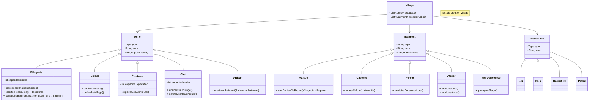

```mermaid

classDiagram
    note "Test de creation village"
    
    class Village{
        - List~Unite~ population
        - List~Batiment~ mobilierUrbain
        
    }
    
    Village --> Unite
    Village --> Batiment
    Village --> Ressource
    
        
    Unite <|-- Villageois
    Unite <|-- Soldat
    Unite <|-- Éclaireur
    Unite <|-- Chef
    Unite <|-- Artisan
    
    class Unite{
        - Type type
        - String nom
        - Integer pointDeVie;
        }
            
     class Villageois{
         - int capaciteRecolte
         + seReposer(Maison maison)
         + recolterRessource() Ressource
         + construireBatiment(Batiment batiment) Batiment
         }
            
     class Soldat{
         + partirEnGuerre()
         + defendreVillage()
         }
         
     class Éclaireur{
         - int capaciteExploration
         + explorerLesAlentours()
         }
            
     class Chef{
         - int capaciteLeader
         + donnerDuCourage()
         + sonnerAlerteGenerale()
         }
         
         class Artisan{
             - ameliorerBatiment(Batiments batiment )
         }

    Batiment <|-- Maison
    Batiment <|-- Caserne
    Batiment <|-- Ferme
    Batiment <|-- Atelier
    Batiment <|-- MurDeDefence
    
    class Batiment{
        - String type
        - String nom
        - Integer resistance
    }
    
    class Maison{
        + sertDeLieuDeRepos(Villageois villageois)
    }
    
    class Caserne{
        + formerSoldat(Unite unite)
    }
    
    class Ferme{
        + produireDeLaNouriture()
    }
    
    class Atelier{
        + produireOutil()
        + produireArme()
    }
    
    class MurDeDefence{
        + protegerVillage()
    }
    
    Ressource <|-- Fer
    Ressource <|-- Bois
    Ressource <|-- Nourriture
    Ressource <|-- Pierre
       
    class Ressource{
        - Type type
        - String nom
    }

    class Fer{

    }

    class Bois{

    }

    class Nourriture{

    }
                
                


```
